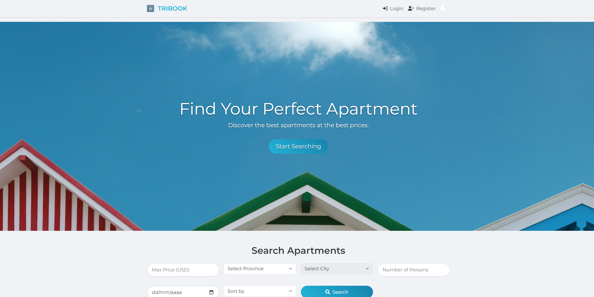
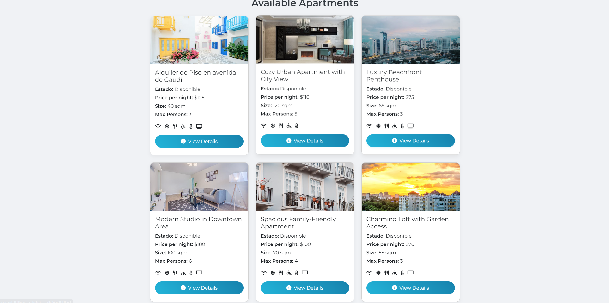
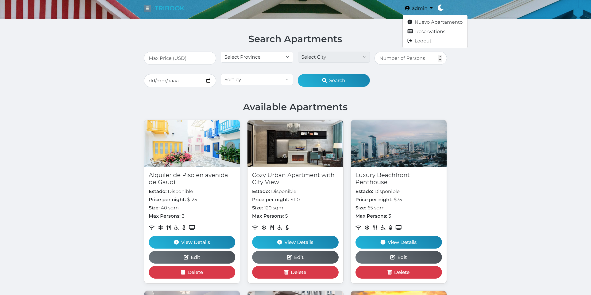
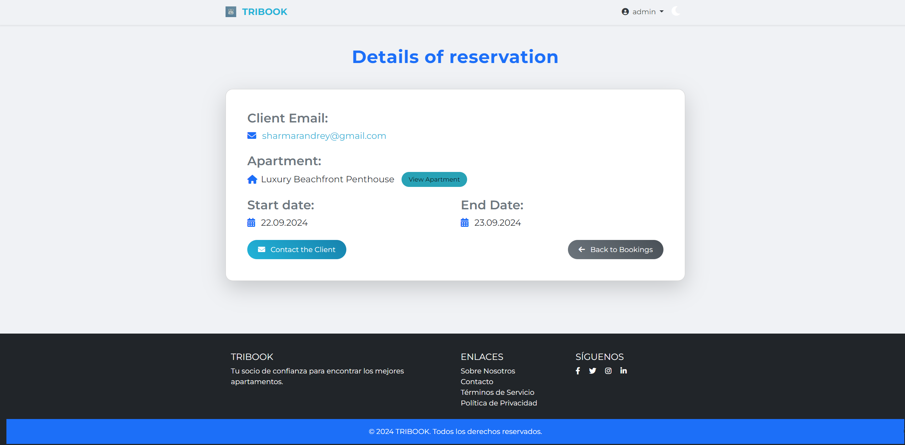

# Tribook Reservations Application 🏢🛏️


Welcome to **Tribook**, an apartment reservation management system that enables users to easily book accommodations while offering admin functionality for managing listings. This project leverages **Express.js**, **MongoDB**, and **EJS** templates for rendering dynamic pages.

---

## Table of Contents
1. [Installation](#installation)
2. [Usage](#usage)
3. [Features](#features)
4. [API Endpoints](#api-endpoints)
5. [Environment Variables](#environment-variables)
6. [Detailed Functionality](#detailed-functionality)
7. [Screenshots](#screenshots)
8. [Live Application](#live-application)
9. [Contributing](#contributing)
10. [License](#license)


---

 
## Installation 

To set up this project locally or on a different machine, follow these steps:

1. **Clone this repository**:
	```bash
	git clone <repository-url>
	```

2. **Navigate to the project directory**:
	```bash
	cd tribook-reservations
	```

3. **Install dependencies**:
	```bash
	npm install
	```

4. **Set up environment variables** in a `.env` file located in the root directory (see [Environment Variables](#environment-variables)).

5. **Start the application**:
	```bash
	npm start
	```

---

## Usage

Once the application is running, open your browser and visit:
- **Home Page**: `http://localhost:3000` – Browse available apartments and make reservations.
- **Admin Dashboard**: `http://localhost:3000/admin` – Manage apartments and reservations (Admin access required).

---

## Features

- **Reservation System**: Users can browse apartments and make reservations based on availability.
- **Apartment Management**: Admins can add, update, or delete apartment listings, including photos, prices, and amenities.
- **User Authentication**: Secure login and registration for users and administrators, with password hashing.
- **Admin Panel**: Admin-only access to manage the entire system, including viewing and canceling reservations.
- **Flash Messages**: Dynamic messages for user feedback after actions (e.g., reservation success or failure).
- **Responsive Design**: The application uses **Bootstrap** for a responsive user interface across devices.

---

## API Endpoints

| Method | Endpoint                    | Description                               |
|--------|-----------------------------|-------------------------------------------|
| GET    | `/api/apartments`            | Retrieve all apartments                   |
| GET    | `/api/apartments/search?q=`  | Search for apartments by query            |
| POST   | `/apartment/new-reservation` | Create a new reservation for an apartment |
| GET    | `/admin/reservations`        | Admin access to view/manage reservations  |

---

## ⚙Environment Variables

Create a `.env` file in the project root to configure the following variables:

```bash
MONGODB_URI=mongodb+srv://<username>:<password>@cluster0.mongodb.net/tribook?retryWrites=true&w=majority
SESSION_SECRET=<your_secure_secret>
PORT=3000
```

### Tips:
- **MongoDB URI**: Replace `<username>` and `<password>` with your actual MongoDB credentials. You can use MongoDB Atlas for cloud database hosting.
- **Session Secret**: Generate a secure session secret by running:
	```bash
	node -e "console.log(require('crypto').randomBytes(64).toString('hex'))"
	```

---

## Detailed Functionality

### 1. **Reservation System**:
   - Users can browse available apartments and book them based on availability. 
   - The reservation process involves selecting a start and end date for the booking, which must fit within the apartment’s available date range. Once reserved, the apartment’s availability is updated.

### 2. **User Authentication**:
   - Users can create accounts or log in with existing credentials. Passwords are securely hashed using bcrypt, and session management ensures users stay logged in across requests.
   - Admins have separate privileges and can access routes that regular users cannot, such as managing apartments and viewing all reservations.

### 3. **Admin Panel**:
   - Admins have access to an admin dashboard that displays a list of reservations and apartments. They can create new apartment listings, modify existing ones, or remove them entirely. The admin panel also shows reservation details, including the client’s email, dates, and apartment information.
   - Admins can cancel any reservation, freeing up apartment availability.

### 4. **Apartment Management**:
   - Admins can add detailed information about apartments, including the number of rooms, price per night, amenities (e.g., WiFi, air conditioning), and available dates. Multiple photos can be uploaded for each apartment.
   - Apartments can be edited and deactivated if they are no longer available.

### 5. **Flash Messaging**:
   - Users are provided with real-time feedback on their actions (e.g., successful reservation, login errors). These messages disappear after viewing.

---

## Screenshots

 Screenshots of your application 

 



---

## Live Application

Access the live version of the application [here](https://tribook-fofj.onrender.com/).

---

## Contributing

We welcome community contributions! Here's how you can help:

1. Fork the repository.
2. Create a new feature branch:
	```bash
	git checkout -b feature-name
	```
3. Commit your changes:
	```bash
	git commit -m "Add new feature"
	```
4. Push to the branch:
	```bash
	git push origin feature-name
	```
5. Create a pull request, and we’ll review it.

---

## 📝License

This project is licensed under the MIT License. See the `LICENSE` file for more details.
